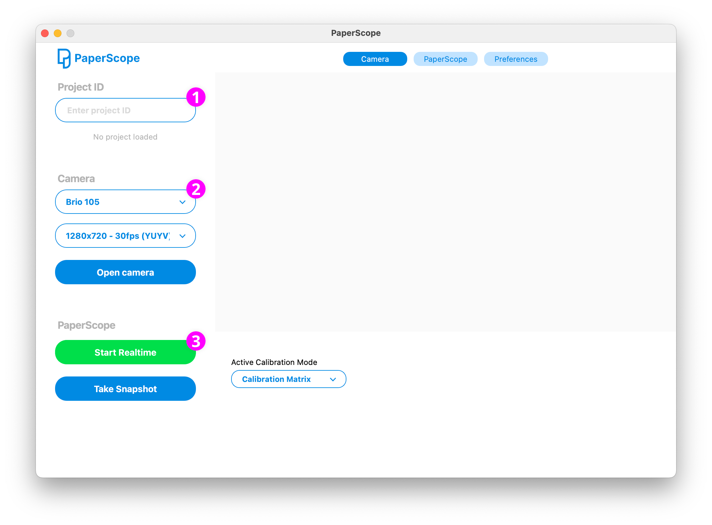

# PaperScope Manager

This guide will help you set up the PaperScope Manager on both Windows and Mac. 


## Prerequisites

- Git
- [Qt Framework](https://www.qt.io/download-open-source)
- [CMake](https://cmake.org) (Windows)
- [Homebrew](https://brew.sh) (Mac)


## Setup

### 1. OpenCV

#### Windows

Download the OpenCV (min v4.10) source code from the [OpenCV GitHub repository](https://github.com/opencv/opencv) and the [OpenCV extra modules](https://github.com/opencv/opencv_contrib).

Open your console and navigate into the OpenCV repository folder:
```
cd opencv-4.10
```

Create a build directory and navigate to it:
```
mkdir build && cd build
```

Configure the build with CMake:
```
cmake -G "Visual Studio 17 2022" -A x64 -DCMAKE_BUILD_TYPE=Release -DBUILD_SHARED_LIBS=ON -DOPENCV_EXTRA_MODULES_PATH=../../opencv_contrib/modules
```

Build OpenCV:
```
cmake --build . --config Release
```

If compiling OpenCV doesn't work, you can use the precompiled files available in the `thirdparty/opencv` directory. For a detailed setup guide visit https://jinscott.medium.com/build-opecv-on-windows-with-cuda-f880270eadb0


#### Mac

Install OpenCV and pkg-config using Homebrew:
```
brew install opencv pkg-config
```

Ensure that pkg-config can find OpenCV:
```
export PKG_CONFIG_PATH=/usr/local/opt/opencv/lib/pkgconfig
```

You can verify the installation by running:
```
pkg-config --modversion opencv4
```
If the installation is successful, you should see the version number of OpenCV.

### 2. QT Creator

Open the Qt Creator application and the PaperScope project via the `PaperScopeManager.pro` file located in the root directory of the repository.

Configure the project to use the appropriate Qt kit for your platform.

Build the project by clicking on the "Build" button or selecting `Build > Build Project` from the menu.

Run the application by clicking on the "Run" button or selecting `Build > Run` from the menu.


## How To Use

### Setup
1. If you want to sync tracked data with a visualizer instance, you need to enter a valid project ID.
2. Select your preferred webcam and resolution/framerate settings. You can switch between different cameras by clicking the "Open camera" button..
3. Select a tracking mode.





### Calibration

There are two calibration modes available:

**Calibration Matrix**:
This mode uses an [OpenCV checkerboard pattern](https://github.com/kyle-bersani/opencv-examples/blob/master/CalibrationByChessboard/chessboard-to-print.pdf) to remove your webcam lens distortion.

**Manual Calibration**:
This mode allows you to manually set the desired tracking area in the webcam view.

1. Use the selectbox "Active Calibration Mode" to switch between modes.
2. To set your calibration click the button "Calibrate".


### PaperScope Config

The PaperScope Tracking Pipeline is separated into 5 stages.

#### 2D Plane

First, the webcam view is transformed into a 2d plane.


#### Processing

Use the four slider in the "Processing" view to optimize the webcam image input. 

**Threshold Dark:** darken background pixels

**Threshold Light**: Increase contrast of drawn shapes for better shape detection. 

**Threshold Red** Modify red color range (hue channel) to optimize street detection.

**Smoothing**: When using the "Calibration Matrix" mode you can smooth out perspective tracking errors and reduce jitter.


#### Threshold

The "Tresholding" view should display all desired shapes without streets (red color).


#### Streets

The "Streets" view should display all streets as thin red lines.


#### Bounding Boxes

The "Bounding Boxes" view shows all classified shapes from our ai model.


#### Contours

The "Contours" view shows the final shapes that will be sent to the visualizer.


